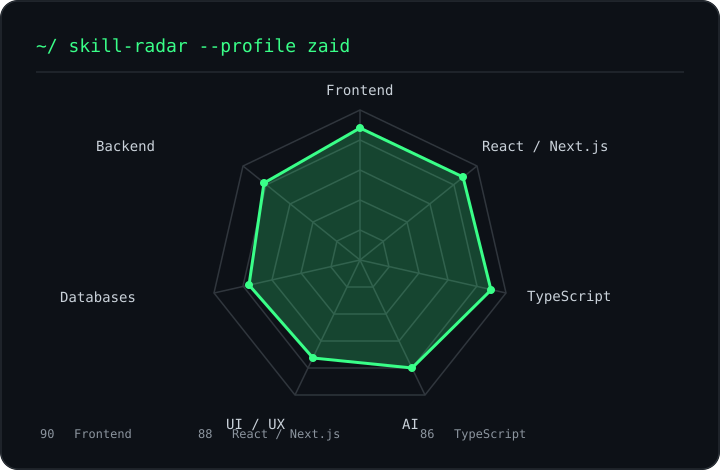

<div align="center">

# `~/ whoami`

```text
$ whoami
zaid@github: Full-stack developer · AI builder · product developer
```

I build polished websites, useful full-stack applications, and AI-powered tools—then keep improving them by shipping.

[GitHub](https://github.com/za1dadrenaline) · [NodeNet](https://nodenet.in)

</div>

---

## `~/ about.txt`

```text
$ cat about.txt

Hi, I'm Zaid.

CURRENTLY
→ Building NodeNet
→ Creating AI-powered web tools
→ Exploring automation and product development
→ Learning by shipping real projects

PHILOSOPHY
→ Build useful things
→ Keep interfaces clean
→ Solve real problems
→ Learn by doing
```

---

## `~/ toolbox`

```text
frontend   HTML · CSS · JavaScript · TypeScript · React · Next.js · Tailwind
backend    Node.js · Python · PostgreSQL · MongoDB · Supabase
shipping   Git · GitHub · Vercel
```

---

## `~/ skill radar`

<div align="center">



</div>

---

## `~/ selected-work`

<table>
<tr>
<td width="50%" valign="top">

### 🟢 [NodeNet](https://github.com/za1dadrenaline/nodenet)

Custom web design and development agency site.

**Focus:** Websites · UI · Development · Client work

</td>
<td width="50%" valign="top">

### 🚗 [AI Car Visualizer](https://github.com/za1dadrenaline/car-visualizer)

AI-powered car modification visualizer.

**Stack:** Next.js · TypeScript · Tailwind · Qwen Image Edit

</td>
</tr>
<tr>
<td width="50%" valign="top">

### 🦇 [Batman × Daredevil Portfolio](https://github.com/za1dadrenaline/batman-daredevil-portfolio)

Noir-themed developer portfolio with cinematic presentation and a local editor.

**Focus:** Creative frontend · UI · Portfolio

</td>
<td width="50%" valign="top">

### ✨ [LUMÉ](https://github.com/za1dadrenaline/lumes)

Premium e-commerce case-study route.

**Focus:** Product design · E-commerce · Case study

</td>
</tr>
</table>

---

## `~/ currently-building`

```text
NodeNet              ████████████████████░░  90%
AI experiments       ████████████████░░░░░░  75%
Automation           ██████████████░░░░░░░░  65%
Product experiments  ████████████░░░░░░░░░░  55%
```

---

## `~/ contribution-calendar`

<div align="center">


<sub>The animation is generated in this repository by GitHub Actions.</sub>

</div>

---

## `~/ connect`

[github.com/za1dadrenaline](https://github.com/za1dadrenaline) · [nodenet.in](https://nodenet.in)

<div align="center">

```text
┌──────────────────────────────────────────────┐
│                                              │
│   "Build things you wish already existed."   │
│                                              │
└──────────────────────────────────────────────┘
```

</div>
